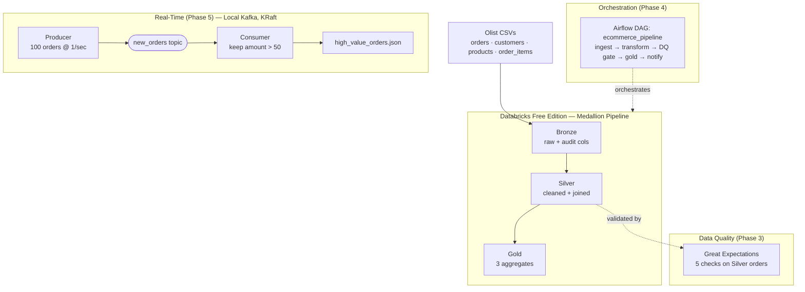

# End-to-End E-Commerce Data Engineering Pipeline

[](LICENSE)

A production-style data engineering pipeline built on the [Olist Brazilian E-Commerce dataset](https://www.kaggle.com/datasets/olistbr/brazilian-ecommerce). It ingests raw CSVs, refines them through a **Bronze → Silver → Gold** medallion architecture, enforces **data quality** with automated checks, **orchestrates** the flow with Apache Airflow, and streams **real-time orders** through Kafka.

---

## Architecture



**The medallion idea:** three stages of increasing trust. *Bronze* is a faithful, untouched copy of the source (plus audit columns). *Silver* is cleaned and joined. *Gold* is aggregated into the specific numbers the business consumes. If a number looks wrong, you re-derive downward from the layer you trust.

---

## Tech Stack

| Layer | Tool |
|---|---|
| Storage & transformation | Databricks Free Edition (PySpark, Delta Lake, Unity Catalog) |
| Data quality | Great Expectations 1.x |
| Orchestration | Apache Airflow 3 (via Astronomer Astro CLI + Docker) |
| Streaming | Apache Kafka (local, KRaft mode, Docker) + `confluent-kafka` client |
| Language | Python / pandas |
| Version control | Git + GitHub |

---

## Repository Structure

```
CapstoneProject/
├── notebooks/            # Databricks notebooks: 01_bronze, 02_silver, 03_gold
├── great_expectations/   # dq_checks.py + gx/ (HTML Data Docs)
├── airflow/              # Astro project; DAG at dags/ecommerce_pipeline.py
├── kafka/                # docker-compose.yml, producer.py, consumer.py, config.py
├── docs/                 # design notes, screenshots
└── README.md
```

---

## The Gold Layer (what the pipeline is *for*)

| Table | Grain | Business question |
|---|---|---|
| `daily_revenue_by_category` | day × category | What sells, and when? |
| `top_customers` | customer | Who are our highest-value buyers? |
| `rolling_7day_order_volume` | day | Is demand rising or falling? |

---

## Setup & How to Run Each Phase

### Prerequisites
- A Databricks Free Edition account (Community Edition was retired end-2025)
- Docker Desktop (or the Podman bundled with the Astro CLI)
- Python 3.11+
- The Olist dataset from Kaggle (four CSVs: orders, customers, products, **order_items**)

### Phases 1–2 · Bronze / Silver / Gold (Databricks)
1. In Databricks, create schemas `bronze`, `silver`, `gold` and a volume for raw files.
2. Upload the four CSVs, then run the notebooks in order:
   - `01_bronze_ingestion` — loads raw CSVs to Delta tables with `ingestion_timestamp` + `source_file` audit columns.
   - `02_silver_transform` — dedupes, standardises dates, joins in the real customer id → `orders_clean`, `order_items_enriched`.
   - `03_gold_aggregates` — builds the three Gold tables (Z-ordered by date).

### Phase 3 · Data Quality (Great Expectations)
```bash
cd great_expectations
python -m pip install great-expectations pandas
python dq_checks.py          # opens an HTML Data Docs report
```
Runs 5 expectations on the Silver orders table; result and report land in `gx/`.

### Phase 4 · Orchestration (Airflow)
```bash
cd airflow
astro dev start              # local Airflow at http://localhost:8080 (admin/admin)
# In the UI: enable + trigger the "ecommerce_pipeline" DAG, view the Gantt chart
astro dev stop
```

### Phase 5 · Real-Time Streaming (Kafka)
```bash
cd kafka
docker compose up -d         # single-node Kafka (KRaft, no ZooKeeper)
python -m pip install confluent-kafka
# Terminal 1:
python consumer.py
# Terminal 2:
python producer.py
# When done:
docker compose down
```
The producer streams 100 order events; the consumer keeps those over 50 and writes them to `high_value_orders.json` (a micro-batch "Silver landing zone").

---

## Data Quality Summary

All 5 Great Expectations checks pass on the Silver orders table:
- `order_id` and `customer_id` are never null
- every `order_amount` is positive
- purchase dates fall within the dataset window (2016–2018)
- every order maps to a known customer (referential integrity)

Cleansing decisions applied in Silver:
- 610 products with a missing category are relabelled `"unknown"` (revenue preserved)
- canceled / unavailable orders are excluded from revenue and lifetime value
- lifetime value is grouped by `customer_unique_id` (96,096 real people), **not** `customer_id` (99,441 per-order ids)

---

## Key Design Decisions

- **Medallion architecture** cleanly separates raw, refined, and business-ready data, so failures are traceable to a layer.
- **`customer_unique_id` vs `customer_id`** — the Olist `customer_id` is unique per *order*, so lifetime value must be grouped by `customer_unique_id` or every customer looks like a one-time buyer.
- **DQ as a gate** — the Airflow `run_dq_checks` task uses a branch operator to either proceed to Gold or quarantine, so bad data can't silently flow downstream.
- **Local Kafka over Confluent Cloud** — a local KRaft broker in Docker avoids a card/signup while using the exact same client code and Kafka concepts.
- **Databricks Free Edition** — the correct current replacement for the retired Community Edition; serverless, so no local Spark install needed.

---

## Deliverables
- Databricks notebooks (Bronze/Silver/Gold) with row counts and schema screenshots
- Great Expectations suite + HTML Data Docs report (5/5 passed)
- Airflow DAG + successful-run Gantt chart
- Kafka producer/consumer + `high_value_orders.json`
- This repository + a 5-minute walkthrough video

---

## License

Licensed under the **Apache License 2.0** — see the [LICENSE](LICENSE) file, or the canonical text at <https://www.apache.org/licenses/LICENSE-2.0>.

Copyright &copy; 2026 Bitan Paul